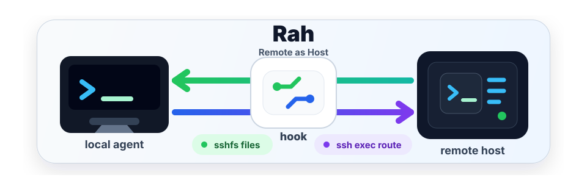
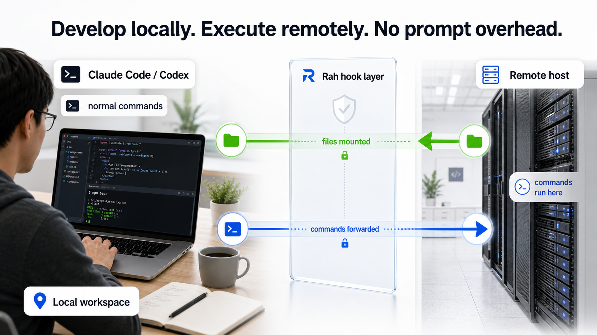
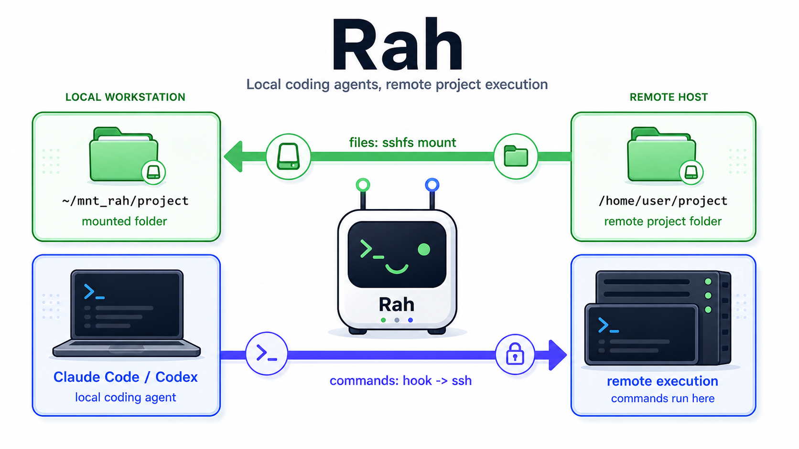

# Remote as Host (rah)

<p align="center">
  
</p>

[](LICENSE)
[](rah)
[](https://hits.sh/github.com/Hiaa1/rah/)
[](README.md#agent-support)
[](README.md#agent-support)

[简体中文](README.zh-CN.md)

Rah lets Claude Code / Codex develop as if it were on a remote machine, while the agent account
stays logged in on one machine you choose.

Typical setup:

- Machine A runs Claude Code / Codex and installs `rah`.
- Machine B or a server holds the real project, large datasets, model weights, and GPU environment.
- You use the agent normally on A; files come from B, and commands execute on B.

Use Rah if you want to:

- avoid spreading Claude Code / Codex sessions across multiple computers, networks, or VPN exits
- control a remote workstation, server, or lab machine from your local agent
- avoid copying datasets or using git as a development sync mechanism

Rah does two things:

- Mounts the remote project as a local folder, for example `~/mnt_rah/<project>`, so you can edit
  remote code like local files.
- Automatically sends the agent's shell commands to the remote machine, so tests, training jobs,
  GPU calls, and dataset access run where the project really lives.

The routing is handled by hooks, not by prompt reminders, so the agent does not need to know it is
doing remote development. **Zero remote install:** install `rah` only on the agent machine; the
remote only needs SSH and basic shell tools.

## Machine Roles

- **agent host**: the machine that runs Claude Code / Codex and `rah`.
- **remote host**: the machine that stores the project, data, environment, and GPU, and actually
  runs commands.

**Install Rah on the agent host, not on the remote host.**

The supported agent host target today is a Unix-like environment with sshfs/FUSE, `ssh`, and
standard shell tools: Ubuntu, Debian, WSL2, and macOS. Native Windows as the agent host is outside
the current scope; Windows users should prefer WSL2.

The remote host does not need `rah`. It only needs SSH access and a project directory. A Linux
server/workstation, or an SSH-enabled macOS machine, can be a remote target.

## Trusted agent gateway

If you pay for a Claude Code or Codex plan and want to use it from multiple computers, frequently
logging the same account in from different devices, networks, or VPN exits can increase account
risk, including security review or lockout. Rah's recommended pattern is to keep the agent account
on one trusted agent host. Other computers reach that host through your own remote-access channel,
and Rah controls the real remote host from there. The account session stays in one place, while
project files and command execution still happen on the right remote machine.

<p align="center">
  
</p>

## Install And Use

### Check Your Environment

- Install `rah` on the machine that runs Claude Code / Codex. Ubuntu, Debian, WSL2, macOS, or a
  Linux gateway are the recommended environments today.
- The remote machine only needs SSH enabled and a project directory. It does not need `rah`.
- If your remote SSH uses a non-default port, pass `--port` during setup.

### Pick One Install Option

Choose one of the two options below. You do not need to run both.

**Option 1: one-line terminal install (recommended)**

```bash
curl -fsSL https://raw.githubusercontent.com/Hiaa1/rah/main/install.sh | bash
```

Check that it works:

```bash
rah version
```

If your shell cannot find `rah`, reopen the terminal or add `~/.local/bin` to `PATH`.

On macOS, if SSHFS is missing, the installer points you to the right path for your machine:
Homebrew, MacPorts, or manual macFUSE + SSHFS installers. macFUSE may require approval in System
Settings before the first mount works. To force a path, set `RAH_MACOS_SSHFS_INSTALLER=brew`,
`macports`, or `manual`.

**Option 2: ask Claude Code / Codex to install it**

In an agent session, say:

> **"Install Rah from github.com/Hiaa1/rah and set it up for `you@host:~/project`."**

The agent can download rah and prepare the commands. If it needs `sudo`, an SSH password,
`ssh-copy-id`, or macFUSE/SSHFS install steps, run the command it prints in a real terminal once.

### Connect Your First Remote Project

Run this in a real terminal:

```bash
rah setup
```

It asks for:

- SSH target, for example `you@devbox.example.com`
- SSH port, or press Enter for the default
- Remote project directory, for example `~/project`
- Local mount directory, or press Enter for the default `~/mnt_rah/<project>`

If you already know the values, you can do it in one line:

```bash
rah setup you@host:~/project
rah setup --port 2222 you@devbox.example.com:~/project
rah setup you@host:~/project ~/projects/project
```

> `rah setup` may install local dependencies (`apt`, Homebrew, MacPorts, or manual macFUSE/SSHFS
> steps), authorize your SSH key, or create a local directory. Those steps can ask for a password,
> so run setup in a real terminal, not inside an agent shell without a TTY.

### Start Developing

After setup, enter the local mount:

```bash
cd ~/mnt_rah/project
rah verify
```

When verification passes, start Claude Code / Codex from this directory. Use the agent normally:

- the agent sees a local folder
- files actually come from the remote project
- shell commands actually execute on the remote

Restart the agent once after the first hook install. After that, new projects only need another
`rah setup` or `rah mount`; the agent does not need to be configured again. To remove everything,
run `rah uninstall`.

## Commands

| Command | Purpose |
|---|---|
| `rah setup [--port PORT] [user@host:/path] [local-path] [-y]` | guided onboarding: deps, ssh key, agent hooks, mount |
| `rah mount [--name N] [--port PORT] [--prelude CMD] user@host:/path [local-path]` | mount a remote code tree locally; defaults to `~/mnt_rah/<project>` |
| `rah mount --same-path user@host:/abs/path` | opt into identical local/remote path mode |
| `rah remount [name\|path]` | recover a dead/stale mount (all if no target) |
| `rah unmount <name\|path>` | unmount + drop the ssh master, keep config |
| `rah remove [--keep-local] [name\|path]` | unmount, remove rah config, rmdir empty mountpoint; current mount if omitted |
| `rah init <claude\|codex> [--remove]` | install/remove the hook + skill for an agent |
| `rah status` / `rah list` | mount / ssh / exec / agent-hook health |
| `rah verify [name\|path]` | end-to-end mount/ssh/hook check |
| `rah doctor` | check dependencies, PATH, mount health |
| `rah self-update` | update to the latest version |
| `rah uninstall [--purge]` | remove hooks, skill, and the `rah` binary |
| `rah run --cwd <dir> -- <cmd>` | run a command on the remote (used by the hook) |
| `rah hook-log on\|off\|status\|clear` | enable/inspect hook diagnostics |

## Mount management

Use `rah status` or `rah list` to see every managed mount, including its name, remote path,
local path, mount health, ssh reachability, and exec-plane health.

- `rah unmount <name|path>` disconnects the mount but keeps the config, so `rah remount <name|path>` can recover it later.
- `rah remove [name|path]` disconnects it, removes the rah config, and removes the local mountpoint only if the directory is empty.
- `rah remove --keep-local [name|path]` removes rah's config while leaving the local directory in place.

## How it works

<p align="center">
  
</p>

```
agent file tools ──► local sshfs mount ──► remote code tree
agent commands ──► PreToolUse hook ──► rah run ──► ssh(ControlMaster) ──► remote: cd + prelude + cmd
```

The hook self-gates by working directory: outside a rah-managed mount it passes commands
through unchanged, so it is safe even if other projects share the same agent. Commands are
carried to the remote base64-encoded (no quoting/injection issues), and the remote exit code is
propagated so the agent's run/verify loop works normally. In mapped mode, rah translates the
local cwd and local absolute path prefixes back to the remote project path before execution.
Standalone `cd` stays local so the shell's working directory is preserved across commands.

## Recovery

A network drop, remote reboot, or laptop sleep can leave the sshfs mount **dead** — file tools
then report `Transport endpoint is not connected` or hang. Because exec and files are separate
channels, **command execution keeps working** while the mount is down. To recover the file plane:

- `rah remount` re-establishes ssh + sshfs (idempotent; runs locally even mid-session).
- The hook also **self-heals**: while you're working it probes the mount (throttled, non-blocking)
  and fires a background `rah remount` if it finds it dead — so it usually recovers on its own.
- `rah status` reports `mounted` / `DEAD` / `not mounted` (a real liveness probe, not a stale flag).

## Hook diagnostics

If an agent appears to run locally from inside a managed mount, enable the hook log and retry one
command:

```bash
rah hook-log on
rah hook-log clear
```

Then run the suspect command in the agent and inspect `~/.config/rah/hook.jsonl`. Each JSONL entry
records whether the hook fired, the reported/effective cwd, mount match, route vs passthrough, and
the emitted decision. Disable it with `rah hook-log off`. For one-off debugging without changing the
flag file, launch the agent with `RAH_HOOK_LOG=1` or set it to a log path.

## Agent support

| Agent | Status | Hook installed by `rah init` |
|---|---|---|
| Claude Code v2.1.158+ | tested | `rah hook --decision allow` |
| Codex CLI v0.137.0+ interactive TUI | tested | `rah hook --decision allow --passthrough empty` |

Codex may ask you to review hooks after install or update. Choose **Trust all and continue** for the
rah hook, then commands launched from a managed mount route to the remote. `codex exec` is not the
target path for rah today; use the interactive CLI/TUI for transparent remote execution.

## Requirements

- **Supported agent host:** Linux or macOS with sshfs/FUSE support; primary targets are Ubuntu,
  Debian, WSL2, and macOS. Native Windows is not supported.
- **Linux local packages:** `bash`, `ssh`, `sshfs` (+ `fuse`/`fuse3`), `jq`, `coreutils`
  (`base64`, `timeout`), `util-linux` (`mountpoint`); `curl` for install/self-update.
- **macOS local packages:** `bash`, `ssh`, `sshfs` through macFUSE, `jq`, `base64`, and `perl`;
  `curl` for install/self-update. For SSHFS/macFUSE, use Homebrew
  (`brew install --cask sshfs-mac`), MacPorts (`sudo port install sshfs`), or the official
  macFUSE + SSHFS installer packages. `rah` can find SSHFS in the usual Homebrew/MacPorts
  locations even if it is not on PATH. Run `rah doctor` to check.
- **SSH:** passwordless key-based ssh to the remote — `ssh <host> true` must succeed without a
  prompt. `rah setup` preflights this and can authorize your key with `ssh-copy-id` or an
  ssh-based fallback.
- **Remote:** a standard OpenSSH server, POSIX shell, and `base64`. A Linux server/workstation or an
  SSH-enabled macOS machine can be a remote target.

## Security

`rah` reroutes the agent's command execution to a remote host over ssh. Claude and Codex currently
require `permissionDecision: "allow"` for `updatedInput.command` rewrites to take effect, so
`rah init claude` and `rah init codex` install allow-mode hooks. Commands inside a rah-managed mount
are approved by the hook after cwd gating; outside a managed mount they pass through unchanged
(Claude receives `defer`, while Codex receives an empty hook response). Use `rah hook-log` when you
need to inspect routing decisions.

## License

[MIT](LICENSE)
