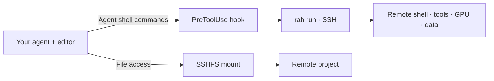

<p align="center">
  
</p>

<p align="center">
  <a href="rah"></a>
  <a href="LICENSE"></a>
  <a href="#compatibility"></a>
  <a href="#how-it-works"></a>
</p>

<p align="center">
  <strong>Keep your coding agent on one machine. Work across your remote hosts.</strong><br>
  SSHFS for files. SSH for commands. Your remote environment, without another agent installation.
</p>

<p align="center">
  <a href="#quick-start">Quick start</a> ·
  <a href="#how-it-works">Architecture</a> ·
  <a href="#recovery-and-diagnostics">Recovery</a> ·
  <a href="docs/guide.md">User guide</a> ·
  <a href="README.zh-CN.md">简体中文</a>
</p>

---

**rah** connects Claude Code and Codex to remote projects through a local mount. Agent file edits reach the remote source tree; the agent's shell commands run over SSH with the remote machine's tools, GPUs, and data.

Install the agent and rah once on the host you choose. Add projects from GPU servers, lab workstations, or shared compute hosts, then switch projects by changing directories. The remote machines need SSH/SFTP, Bash, and `base64`; they do not need rah or a coding agent installed.

| Capability | What it gives you |
| :--- | :--- |
| **One agent, multiple hosts** | Keep your agent configuration and login on one machine; use each remote's existing environment. |
| **Automatic command routing** | Hooks select the remote from the working directory. Ordinary agent commands need no SSH prefix. |
| **Explicit local execution** | Use `rah local` for host-side tools, or `rah run --cwd` to select another remote project. |
| **Independent recovery** | Linux services supervise each mount. A failed host does not stop recovery checks for other hosts. |

## Quick start

### 1. Install on your agent host

```bash
curl -fsSL https://raw.githubusercontent.com/Hiaa1/rah/main/install.sh | bash
```

Linux and macOS are supported. The installer places rah in `~/.local/bin`; reopen your terminal if it is not yet on `PATH`. You can also [install from a local checkout](docs/guide.md#installation-and-updates).

### 2. Connect a project

```bash
rah setup you@gpu-server:~/project
```

Run this in an interactive terminal. Setup checks dependencies and SSH access, installs hooks for detected agents, and mounts the project. Use `rah setup` for the guided form, or add `--port 2222` for a custom SSH port.

### 3. Start your agent

```bash
cd ~/mnt_rah/project
rah verify
codex                         # or: claude
```

Ask the agent to edit a file, run tests, or inspect the remote GPU. Its file operations use the mount; its shell commands use the remote environment. Automatic routing applies to supported **agent tool calls**. An ordinary terminal still needs `rah run` to execute remotely.

If you install an agent later, run `rah init codex` or `rah init claude`, then restart that agent.

## How it works


```mermaid
flowchart LR
    A["Your agent + editor"] -->|"File access"| F["SSHFS mount"]
    A -->|"Agent shell commands"| H["PreToolUse hook"]
    H --> R["rah run · SSH"]
    F --> P["Remote project"]
    R --> E["Remote shell · tools · GPU · data"]
```

The hook maps the local working directory back to its remote path. Files and commands travel over separate SSH connections, so mount recovery can operate independently of the command connection.

**Mount the code you edit.** Keep large datasets, model weights, caches, and outputs outside the mounted tree where practical; access them through commands on the remote host.

### Multiple projects, one workflow

```bash
rah setup gpu:~/project ~/mnt_rah/gpu-project
rah setup lab:~/project ~/mnt_rah/lab-project

# Execute on the remote selected by its local mount path
rah run --cwd ~/mnt_rah/gpu-project -- nvidia-smi

# Read or compare mounted files on the agent host
rah local -- diff ~/mnt_rah/gpu-project/config.yaml ~/mnt_rah/lab-project/config.yaml
```

SSH aliases carry your `HostName`, `Port`, `ProxyJump`, and `ProxyCommand` settings. See the [networking guide](docs/guide.md#ssh-and-private-networks) for private networks and reverse tunnels.

## Recovery and diagnostics

```bash
rah status                    # Check all managed projects
rah remount                   # Recover dead or missing mounts
rah autostart on              # Enable recovery after login / reboot
```

| Mechanism | Current behavior |
| :--- | :--- |
| **Responsive status** | Up to 8 mounts checked concurrently per batch; each SSH probe has a 3-second deadline. |
| **Real filesystem checks** | Fresh filename lookups avoid treating cached directory metadata as proof of a live mount. |
| **Linux supervision** | One foreground SSHFS service per mount, with a health check 15 seconds after the previous check finishes. |
| **Bounded recovery** | Probe timeouts, failed-start cleanup, and a 30-second restart delay between service attempts. |
| **macOS persistence** | A LaunchAgent periodically runs recovery; manual mounts retain SSHFS reconnection. |

`rah status` reports timeouts separately from failures and does not create or repair SSH masters. Use `rah verify <name>` for a fuller routing check, or `rah doctor` for dependencies and host diagnostics.

A disconnected filesystem can interrupt writes; an editor may need to reopen files after recovery. Keep VS Code Server, your login shell, and rah itself on the agent host's local disk. [Recovery details and troubleshooting →](docs/guide.md#recovery-and-troubleshooting)

## Compatibility

| Component | Supported environment |
| :--- | :--- |
| Agent host | Linux or macOS with SSHFS/FUSE. WSL2 requires working FUSE support. |
| Remote host | Linux or macOS with SSH/SFTP access, Bash, and `base64`. |
| Claude Code | `PreToolUse` routing for Bash tool calls. |
| Codex CLI | Interactive CLI/TUI with the configured `PreToolUse` hook. |
| Authentication | Non-interactive SSH access, normally through SSH keys. |

Native Windows agent hosts and transparent routing through `codex exec` are not supported paths. Hook support depends on the installed agent version; `rah verify` checks the integration in your environment.

**Execution boundary.** rah's installed hooks use `permissionDecision: "allow"` to apply command rewrites inside managed mounts. Read the [execution and trust model](docs/guide.md#execution-and-trust) before enabling the integration on shared hosts or unfamiliar projects.

## Documentation

| Guide | Contents |
| :--- | :--- |
| [Command reference](docs/guide.md#command-reference) | Setup, mounts, routing, diagnostics, and removal. |
| [Remote environments](docs/guide.md#remote-environments) | Virtual environments, ports, named mounts, and path mapping. |
| [Local execution](docs/guide.md#local-execution-and-other-mounts) | `rah local`, cross-mount access, and the executable allow list. |
| [Recovery and troubleshooting](docs/guide.md#recovery-and-troubleshooting) | Stale mounts, timeouts, VS Code, and service logs. |
| [Installation and updates](docs/guide.md#installation-and-updates) | Downloaded installs, Git checkouts, and applying service changes. |
| [中文文档](README.zh-CN.md) | 中文快速开始与完整使用指南。 |

## Contributing

Bug reports and focused pull requests are welcome. Include your OS, installation method, `rah version`, and the relevant error output. Remove credentials and sensitive command arguments before sharing logs.

```bash
bash -n rah install.sh
python3 -m unittest discover -s tests -v
```

The automated tests use isolated fixtures and fake SSH commands; they do not need your remote servers. See [maintaining the documentation](docs/guide.md#maintaining-the-documentation) for version and language conventions.

[Report an issue](https://github.com/Hiaa1/rah/issues) · [Browse the source](https://github.com/Hiaa1/rah) · [MIT license](LICENSE)
