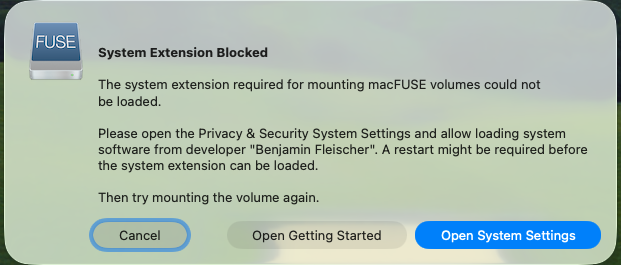

# Remote as Host (rah)

<p align="center">
  
</p>

[](LICENSE)
[](rah)
[](https://hits.sh/github.com/Hiaa1/rah/)
[](README.zh-CN.md#agent-支持)
[](README.zh-CN.md#agent-支持)

[English](README.md)

你是否需要在讨厌的集群服务器上面开发项目？你是否需要和他人共享coding plan？你是否有多台执行命令的服务器但是又不想都配上你的coding agent？如果是的话，这就是你需要的工具 - Rah。

Rah 让 Claude Code / Codex 像在远端机器上一样开发项目，但账号只登录在你指定的一台电脑上。

**对 agent 无感。** Claude Code / Codex 看到的是本地目录和普通 shell：`cat`、`pytest`、`python train.py`、`nvidia-smi` 都照常运行。Rah 在工具层自动完成文件挂载和命令转发，让文件来自远端、命令也在远端执行，不占 prompt，不靠模型记住“要 SSH 到远端”。

## 使用场景

### 1. 个人电脑接入远程开发主机

适合用个人 Mac/Ubuntu 电脑远程 workstation、服务器或实验机器干活的用户。

- **主机 A**：你的本地 Mac/Ubuntu/WSL2/Linux gateway，运行 Claude Code / Codex，并安装 `rah`。
- **主机 B**：远程开发主机，存放代码、数据集、模型权重和 GPU 环境，只需要开启 SSH。
- 在主机 A 上用 `rah` 挂载主机 B 的项目目录，例如挂到 `~/mnt_rah/<project>`。
- 你在主机 A 进入这个挂载目录启动 Claude Code / Codex；agent 读写的是 B 的文件，命令也在 B 上执行。

### 2. 共享 agent 主机作为多人入口

适合团队或实验室把 Claude Code / Codex 登录态集中在一台可信主机上的用法。

- **A1、A2、A3...**：每个人自己的电脑，只需要能 SSH 连接到共享 agent 主机。
- **主机 B**：共享 agent 主机，安装 Claude Code / Codex 和 `rah`，作为统一的开发入口。
- **C1、C2、C3...**：每个人自己的代码主机、工作站或服务器，分别存放各自项目、数据和环境。
- 用户从自己的电脑 SSH 到主机 B，再用 `rah` 把自己的 Cj 项目挂载到 B 上的个人工作目录。
- 每个人都在主机 B 的个人工作目录里启动 Claude Code / Codex；文件来自各自的 Cj，命令也在各自的 Cj 上执行。

## 当前支持 / TODO

- [x] **推荐模式：Linux 共享 agent host。** 在一台 Linux 主机 B 上安装 Claude Code / Codex 和 `rah`，其它电脑 A1/A2/A3... 通过 SSH 登录 B；B 再把各自的远端工作目录 Cj 挂载到个人工作目录中使用。远端 Cj 可以是 Linux/macOS，或提供 SSH/SFTP 与类 Unix shell 环境的 Windows/WSL2。
- [x] **个人模式：本机 Linux/macOS agent host + 远程 Linux 开发机。** 在自己的 Linux 或 macOS 办公机上安装 Claude Code / Codex 和 `rah`，把远程 Linux workstation/GPU 服务器的工作目录挂载到本机，然后从挂载目录启动 agent。
- [x] **macOS 作为 agent host。** macOS 可通过 macFUSE + SSHFS 使用 Rah；安装器会提示 Homebrew、MacPorts 或手动安装路径。
- [x] **远端在 NAT 后 / 无公网 IP。** 远端收不到入站 SSH 时，在 rah 下面一层给它可达性（Tailscale 或反向 SSH 隧道），然后用 `~/.ssh/config` 别名作为 rah 目标即可。见 [远端在 NAT 后](#远端在-nat-后无公网-ip)。
- [ ] **原生 Windows 作为 agent host。** 暂不支持；Windows 用户优先使用 WSL2，或 SSH 到一台 Linux agent host。
- [ ] **原生 Windows 作为 remote host。** 仅在具备 SSH/SFTP 和类 Unix shell/base64 环境时可尝试；普通 Windows 原生命令环境不是当前稳定目标。

适合你如果：

- 不想把 Claude Code / Codex 登录态散落到多台电脑、不同网络或不同 VPN 出口。
- 想用本地 agent 操作远端工作站、服务器或实验机器。
- 不想复制大数据集、不想靠 git 同步开发状态。

Rah 做两件事：

- 把远端项目目录挂载成本地目录，例如 `~/mnt_rah/<project>`，你可以像编辑本地文件一样编辑远端代码。
- 自动把 agent 的 shell 命令转发到远端执行，例如测试、训练、调用 GPU、读取大数据集。

这些转发由 hook 自动完成，不靠提示词提醒 agent，所以 agent 不需要知道自己在“远程开发”。
**远端零安装**：只在 agent 所在机器安装 `rah`；远端只需要标准 SSH 和基本 shell 工具。

## 机器角色

- **agent host**：运行 Claude Code / Codex 和 `rah` 的机器。
- **remote host**：存放项目、数据、环境和 GPU，并真正执行命令的机器。

**Rah 安装在 agent host 上，不安装在 remote host 上。**

当前支持的 agent host 是具备 sshfs/FUSE、`ssh` 和标准 shell 工具的 Unix-like 环境，主要是 Ubuntu、Debian、WSL2 和 macOS。
原生 Windows 作为 agent host 不在当前范围内；Windows 用户优先使用 WSL2。

remote host 不需要安装 `rah`。它只需要能 SSH 登录，并提供可访问的项目目录；Linux server、workstation，或开启 SSH 的 macOS 机器都可以作为 remote target。

## 可信 Agent 网关

如果你购买了 Claude Code 或 Codex 的个人 plan，又想在多台电脑上使用，频繁从不同设备、
网络或 VPN 出口登录同一账号可能增加风控风险。Rah 推荐把 agent 账号固定在一台可信的
agent host 上；其它电脑通过你自己的远程访问方式连接到这台 agent host，再由 Rah 操控真正的
remote host。这样账号登录态只留在一个地方，项目和命令执行仍然发生在正确的远端机器上。

<p align="center">
  
</p>

## 安装和使用

### 先确认环境

- 在运行 Claude Code / Codex 的这台机器上安装 `rah`。当前推荐 Ubuntu、Debian、WSL2、macOS 或 Linux gateway。
- 远端机器只需要开启 SSH，并且有你的项目目录；远端不需要安装 `rah`。
- 如果远端 SSH 不是默认 22 端口，后面 setup 时填 `--port` 即可。

### 选择一种安装方式

下面两种方式二选一，不需要都执行。

**方式一：终端一行安装（推荐）**

```bash
curl -fsSL https://raw.githubusercontent.com/Hiaa1/rah/main/install.sh | bash
```

安装后检查一下：

```bash
rah version
```

如果提示找不到 `rah`，重新打开终端，或者把 `~/.local/bin` 加到 `PATH`。

macOS 上如果缺少 SSHFS，安装器会按你的机器给出 Homebrew、MacPorts 或手动安装 macFUSE + SSHFS 的路径。macFUSE 第一次挂载前可能需要在系统设置里批准。需要强制选择路径时，可以设置 `RAH_MACOS_SSHFS_INSTALLER=brew`、`macports` 或 `manual`。

如果第一次挂载时看到 macFUSE 的 **System Extension Blocked** 提示，点击 **Open System Settings**，在系统设置的隐私与安全性里允许 macFUSE 系统扩展，然后重新尝试挂载：

<p align="center">
  
</p>

**方式二：让 Claude Code / Codex 帮你安装**

在 agent 会话里直接说：

> **“Install Rah from github.com/Hiaa1/rah and set it up for `you@host:~/project`.”**

agent 可以帮你下载和运行命令。如果遇到 `sudo`、SSH 密码、`ssh-copy-id` 或 macFUSE/SSHFS 安装提示，请按它给出的命令回到真实终端执行一次。

### 第一次连接远端项目

在真实终端里运行：

```bash
rah setup
```

它会依次询问：

- SSH 地址，例如 `you@devbox.example.com`
- SSH 端口，可以直接回车使用默认端口
- 远端项目目录，例如 `~/project`
- 本地挂载目录，可以直接回车使用默认 `~/mnt_rah/<project>`

如果你已经知道完整参数，也可以一行完成：

```bash
rah setup you@host:~/project
rah setup --port 2222 you@devbox.example.com:~/project
rah setup you@host:~/project ~/projects/project
```

> `rah setup` 可能需要安装本地依赖（`apt`、Homebrew、MacPorts 或手动 macFUSE/SSHFS）、授权 SSH key 或创建本地目录，这些步骤可能要求输入密码。请在真实终端运行它，不要在 agent 的无 TTY shell 里运行。

### 开始开发

setup 完成后，进入本地挂载目录：

```bash
cd ~/mnt_rah/project
rah verify
```

验证通过后，从这个目录启动 Claude Code / Codex。之后你照常让 agent 读写文件、运行测试或启动训练：

- agent 看到的是本地目录
- 文件实际来自远端项目
- shell 命令实际在远端执行

第一次安装 hook 后需要重启一次 agent。之后新增项目只需要再次运行 `rah setup` 或 `rah mount`，不需要重新配置 agent。完全移除可运行 `rah uninstall`。

## 远端在 NAT 后（无公网 IP）

Rah 需要一个能连上的 SSH 目的地：执行走 `ssh <host>`，文件走 `sshfs <host>:<path>`。如果远端在
NAT/CGNAT 后面、没有公网 IP，它收不到入站 SSH，两条平面都会失败。NAT 穿透应当在 rah **下面一层**
解决:先给远端一个可达地址,把它写成 `~/.ssh/config` 的别名,然后让 `rah setup` 指向这个别名即可。
rah 不需要任何额外参数——`ssh` 和 `sshfs` 都会继承别名里的 `HostName`、`Port`、`ProxyJump`、
`ProxyCommand`。

### 方案一 —— Tailscale（推荐）

即使两端都在 NAT 后也能用(打洞 + DERP 中继兜底),不需要公网 IP 或 VPS。

1. 在两台机器上安装 Tailscale,接入同一个 tailnet:
   ```bash
   tailscale up        # 在远端和 agent 机器上都执行
   tailscale status    # 找到远端的 MagicDNS 名,例如 gpu-home.tailXXXX.ts.net
   ```
2. 在 agent 机器的 `~/.ssh/config` 里加一个别名:
   ```
   Host gpu-home
       HostName gpu-home.tailXXXX.ts.net
       User you
   ```
3. 用别名作为 rah 目标:
   ```bash
   rah setup gpu-home:/home/you/project
   ```

### 方案二 —— 反向 SSH 隧道（自托管）

如果你不想依赖第三方叠加网,并且有一台公网中继机(便宜的 VPS,或任意有公网 IP 的常开机器),用这个。

1. 在远端常驻一条到中继机的反向隧道(用 `autossh`、systemd 单元或 `tmux` 守护):
   ```bash
   autossh -M 0 -N -R 2222:localhost:22 you@relay.example.com
   ```
2. 在 agent 机器上,经中继机转发的端口连到远端:
   ```
   Host gpu-home
       HostName localhost
       Port 2222
       ProxyJump you@relay.example.com
       User you
   ```
3. 用别名作为 rah 目标:
   ```bash
   rah setup gpu-home:/home/you/project
   ```

端口和代理设置都写在 `~/.ssh/config` 里;rah 只用别名,执行面和 sshfs 挂载都会继承它。如果
`rah setup`/`rah mount` 报 SSH 预检失败,rah 会把上面这两种方案作为提示打印出来。

## 命令

| 命令 | 用途 |
|---|---|
| `rah setup [--port PORT] [user@host:/path] [local-path] [-y]` | 引导式初始化：依赖、ssh key、agent hook、挂载 |
| `rah mount [--name N] [--port PORT] [--prelude CMD] user@host:/path [local-path]` | 把远端代码树挂到本地，默认 `~/mnt_rah/<project>` |
| `rah mount --same-path user@host:/abs/path` | 显式使用本地/远端完全同路径模式 |
| `rah remount [name\|path]` | 恢复失效或 stale mount，不传目标则恢复全部 |
| `rah unmount <name\|path>` | 卸载并关闭 ssh master 连接，保留配置 |
| `rah remove [--keep-local] [name\|path]` | 卸载、删除 rah 配置，并删除空的 mountpoint 目录；不传目标则使用当前 mount |
| `rah init <claude\|codex> [--remove]` | 安装或移除 agent hook 和 skill |
| `rah status` / `rah list` | 查看 mount / ssh / exec / agent hook 状态 |
| `rah verify [name\|path]` | 端到端检查 mount、ssh、hook |
| `rah doctor` | 检查依赖、PATH、mount 健康状态 |
| `rah self-update` | 更新到最新版本 |
| `rah uninstall [--purge]` | 移除 hook、skill 和 `rah` 二进制 |
| `rah run --cwd <dir> -- <cmd>` | 在远端执行命令，hook 内部使用 |
| `rah hook-log on\|off\|status\|clear` | 开启或查看 hook 诊断日志 |

## Mount 管理

用 `rah status` 或 `rah list` 查看所有受管理 mount，包括名称、远端路径、本地路径、mount 健康状态、ssh 连通性和执行面健康状态。

- `rah unmount <name|path>` 只断开 mount，保留配置，之后可以用 `rah remount <name|path>` 恢复。
- `rah remove [name|path]` 会断开 mount、删除 rah 配置，并且只在本地 mountpoint 为空时删除这个目录。
- `rah remove --keep-local [name|path]` 删除 rah 配置，但保留本地目录。

## 工作原理

<p align="center">
  
</p>

```text
agent file tools -> local sshfs mount -> remote code tree
agent commands -> PreToolUse hook -> rah run -> ssh(ControlMaster) -> remote: cd + prelude + cmd
```

hook 按工作目录自门控：不在 rah 管理的 mount 内时，命令原样放行，所以全局安装也安全。命令以 base64 形式传到远端，避免 shell quoting 和注入问题；远端退出码会原样传播，agent 的运行和验证循环可以正常工作。在映射模式下，rah 会在远端执行前把本地 cwd 和命令里的本地绝对路径前缀翻译回远端项目路径。独立的 `cd` 会保留在本地，以维持 agent 持久 shell 的 cwd。

## 恢复

网络中断、远端重启或本机睡眠都可能让 sshfs mount 变成 **dead**。此时文件工具可能报 `Transport endpoint is not connected` 或卡住。因为执行面和文件面是分开的，**命令执行仍会继续工作**。恢复文件面：

- `rah remount` 会重新建立 ssh 和 sshfs，幂等，可在会话中途运行。
- hook 也会 **自愈**：工作时会节流探测 mount；如果发现 mount 已死，会后台触发 `rah remount`，通常能自动恢复。
- `rah status` 会报告 `mounted` / `DEAD` / `not mounted`，使用真实 liveness probe，而不是 stale 标记。

## Hook 诊断

如果 agent 在受管理 mount 内看起来仍然本地执行，开启 hook 日志并重试一条命令：

```bash
rah hook-log on
rah hook-log clear
```

然后在 agent 里运行可疑命令，查看 `~/.config/rah/hook.jsonl`。每条 JSONL 会记录 hook 是否触发、上报/实际 cwd、是否匹配 mount、route 还是 passthrough，以及发出的 decision。用 `rah hook-log off` 关闭。一次性调试也可以在启动 agent 时设置 `RAH_HOOK_LOG=1`，或把它设为日志路径。

## Agent 支持

| Agent | 状态 | `rah init` 安装的 hook |
|---|---|---|
| Claude Code v2.1.158+ | 已实测 | `rah hook --decision allow` |
| Codex CLI v0.137.0+ 交互式 TUI | 已实测 | `rah hook --decision allow --passthrough empty` |

Codex 在安装或更新后可能要求你 review hooks。对 rah hook 选择 **Trust all and continue** 后，从受管理 mount 发出的命令会路由到远端。`codex exec` 目前不是 rah 的目标路径；透明远端执行请使用交互式 CLI/TUI。

## 要求

- **支持的 agent host**：具备 sshfs/FUSE 支持的 Linux 或 macOS；主要目标是 Ubuntu、Debian、WSL2 和 macOS。当前不支持原生 Windows。
- **Linux 本地依赖包**：`bash`、`ssh`、`sshfs`（加 `fuse`/`fuse3`）、`jq`、`coreutils`（`base64`、`timeout`）、`util-linux`（`mountpoint`）；安装和自更新需要 `curl`。
- **macOS 本地依赖包**：`bash`、`ssh`、通过 macFUSE 提供的 `sshfs`、`jq`、`base64` 和 `perl`；安装和自更新需要 `curl`。SSHFS/macFUSE 可以通过 Homebrew（`brew install --cask sshfs-mac`）、MacPorts（`sudo port install sshfs`）或官方 macFUSE + SSHFS 安装包安装。即使 SSHFS 不在 PATH，`rah` 也会尝试在常见 Homebrew/MacPorts 路径中查找。运行 `rah doctor` 检查。
- **SSH**：必须能 passwordless key-based ssh 到远端，`ssh <host> true` 不能要求输入密码。`rah setup` 会预检，并可通过 `ssh-copy-id` 或 ssh fallback 授权你的 key。
- **远端**：只需要标准 OpenSSH server、POSIX shell 和 `base64`。Linux server/workstation 或开启 SSH 的 macOS 都可以作为 remote target。

## 安全

`rah` 会把 agent 的命令执行路由到远端主机。Claude 和 Codex 当前都需要 `permissionDecision: "allow"` 才会应用 `updatedInput.command` 改写，所以 `rah init claude` 和 `rah init codex` 会安装 allow-mode hook。位于 rah 管理 mount 内的命令会在 cwd 门控后由 hook 批准；mount 外的命令保持原样放行（Claude 收到 `defer`，Codex 收到空 hook 响应）。需要排查时，可以用 `rah hook-log` 查看每次 hook 的路由决策。

## License

[MIT](LICENSE)
