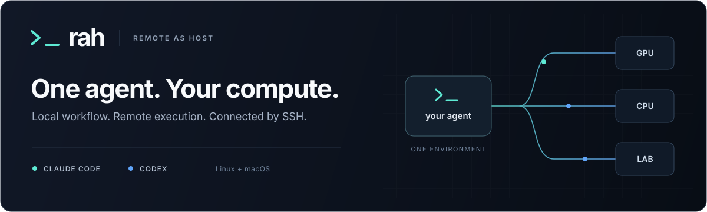
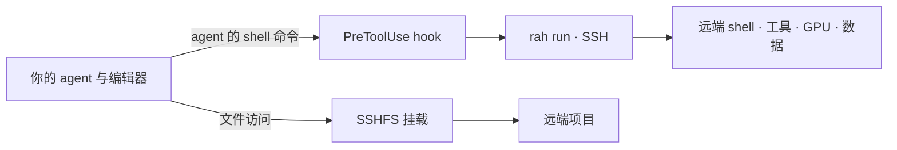

<p align="center">
  
</p>

<p align="center">
  <a href="rah"></a>
  <a href="LICENSE"></a>
  <a href="#兼容性"></a>
  <a href="#工作原理"></a>
</p>

<p align="center">
  <strong>一套 coding agent 环境，连接你的多台远端主机。</strong><br>
  SSHFS 访问文件，SSH 执行命令。直接使用远端环境，无需重复安装 agent。
</p>

<p align="center">
  <a href="#快速开始">快速开始</a> ·
  <a href="#工作原理">工作原理</a> ·
  <a href="#恢复与诊断">恢复与诊断</a> ·
  <a href="docs/guide.zh-CN.md">使用指南</a> ·
  <a href="README.md">English</a>
</p>

---

**rah** 通过本地挂载目录，将 Claude Code 和 Codex 连接到远端项目。agent 对文件的修改直接落到远端代码树；agent 的 shell 命令通过 SSH 执行，使用远端已有的工具、GPU 和数据。

在你选择的主机上安装一次 agent 和 rah，就可以接入 GPU 服务器、实验室工作站和共享计算主机，通过切换目录选择项目。远端只需要 SSH/SFTP、Bash 和 `base64`，无需安装 rah 或 coding agent。

| 能力 | 带来的体验 |
| :--- | :--- |
| **一套 agent，多台主机** | agent 配置和登录态集中在一台机器上，各远端继续使用自己的运行环境。 |
| **自动命令路由** | hook 根据工作目录选择远端，agent 的普通命令无需手动添加 SSH 前缀。 |
| **显式本机执行** | 用 `rah local` 运行本机工具，用 `rah run --cwd` 指定另一个远端项目。 |
| **独立故障恢复** | Linux 服务分别管理每个挂载，一台主机失联不会阻止其他挂载的恢复检查。 |

## 快速开始

### 1. 在 agent 主机上安装

```bash
curl -fsSL https://raw.githubusercontent.com/Hiaa1/rah/main/install.sh | bash
```

支持 Linux 和 macOS。安装程序将 rah 放入 `~/.local/bin`；如果命令尚未加入 `PATH`，请重新打开终端。也可以[从本地仓库安装](docs/guide.zh-CN.md#安装与更新)。

### 2. 连接项目

```bash
rah setup you@gpu-server:~/project
```

请在交互式终端执行。Setup 会检查依赖和 SSH 连接，为检测到的 agent 安装 hook，并挂载项目。直接运行 `rah setup` 可进入向导；非默认 SSH 端口可添加 `--port 2222`。

### 3. 启动 agent

```bash
cd ~/mnt_rah/project
rah verify
codex                         # 或者：claude
```

让 agent 修改文件、运行测试或检查远端 GPU 即可。文件操作通过挂载完成，shell 命令使用远端环境。自动路由作用于受支持的 **agent 工具调用**；普通终端中的命令仍需通过 `rah run` 显式在远端执行。

如果之后才安装 agent，运行 `rah init codex` 或 `rah init claude`，然后重启该 agent。

## 工作原理


```mermaid
flowchart LR
    A["你的 agent 与编辑器"] -->|"文件访问"| F["SSHFS 挂载"]
    A -->|"agent 的 shell 命令"| H["PreToolUse hook"]
    H --> R["rah run · SSH"]
    F --> P["远端项目"]
    R --> E["远端 shell · 工具 · GPU · 数据"]
```

Hook 将本地工作目录映射回远端路径。文件访问和命令执行使用独立的 SSH 连接，使挂载恢复可以独立于命令连接运行。

**挂载需要编辑的代码。** 大型数据集、模型权重、缓存和输出尽量放在挂载目录之外，通过远端命令直接访问。

### 多个项目，同一套工作流

```bash
rah setup gpu:~/project ~/mnt_rah/gpu-project
rah setup lab:~/project ~/mnt_rah/lab-project

# 通过本地挂载路径选择执行命令的远端
rah run --cwd ~/mnt_rah/gpu-project -- nvidia-smi

# 在 agent 主机上读取或比较挂载文件
rah local -- diff ~/mnt_rah/gpu-project/config.yaml ~/mnt_rah/lab-project/config.yaml
```

SSH alias 会保留你的 `HostName`、`Port`、`ProxyJump` 和 `ProxyCommand` 配置。私网连接和反向隧道见[网络配置指南](docs/guide.zh-CN.md#ssh-与私网连接)。

## 恢复与诊断

```bash
rah status                    # 检查所有受管理的项目
rah remount                   # 恢复失效或未挂载的项目
rah autostart on              # 启用登录 / 重启后的自动恢复
```

| 机制 | 当前行为 |
| :--- | :--- |
| **快速状态查询** | 每批最多并发检查 8 个挂载，每个 SSH 探测限时 3 秒。 |
| **真实文件系统探测** | 查找全新的文件名，避免把缓存的目录属性误判为挂载正常。 |
| **Linux 服务管理** | 每个挂载独立运行前台 SSHFS 服务，上一次健康检查结束 15 秒后再次检查。 |
| **有界恢复** | 探测超时、启动失败清理，以及服务尝试之间的 30 秒重启等待。 |
| **macOS 自动恢复** | LaunchAgent 周期性执行恢复，手动挂载保留 SSHFS 自身的重连机制。 |

`rah status` 区分超时和失败，不会创建或修复 SSH master。使用 `rah verify <name>` 检查完整路由，使用 `rah doctor` 检查依赖和本机环境。

断线可能中断写入，恢复后编辑器可能需要重新打开文件。VS Code Server、登录 shell 和 rah 程序本身应保留在 agent 主机的本地磁盘。[恢复细节与排障 →](docs/guide.zh-CN.md#恢复与排障)

## 兼容性

| 组件 | 支持的环境 |
| :--- | :--- |
| Agent 主机 | 支持 SSHFS/FUSE 的 Linux 或 macOS；WSL2 需要可用的 FUSE。 |
| 远端主机 | 提供 SSH/SFTP、Bash 和 `base64` 的 Linux 或 macOS。 |
| Claude Code | 通过 `PreToolUse` 路由 Bash 工具调用。 |
| Codex CLI | 配置了 `PreToolUse` hook 的交互式 CLI/TUI。 |
| 身份认证 | 非交互式 SSH 访问，通常使用 SSH key。 |

原生 Windows agent 主机和通过 `codex exec` 实现透明路由，目前不属于支持路径。Hook 支持取决于安装的 agent 版本；`rah verify` 会检查当前环境中的集成。

**执行边界。** rah 安装的 hook 使用 `permissionDecision: "allow"`，对受管理挂载内的命令应用改写。在共享主机或不熟悉的项目中启用集成前，请阅读[执行与信任模型](docs/guide.zh-CN.md#执行与信任)。

## 文档导航

| 指南 | 内容 |
| :--- | :--- |
| [命令参考](docs/guide.zh-CN.md#命令参考) | 安装向导、挂载、路由、诊断和移除。 |
| [远端环境](docs/guide.zh-CN.md#远端环境) | 虚拟环境、端口、命名挂载与路径映射。 |
| [本机执行与跨挂载访问](docs/guide.zh-CN.md#本机执行与跨挂载访问) | `rah local`、多个挂载之间的访问、可执行文件白名单。 |
| [恢复与排障](docs/guide.zh-CN.md#恢复与排障) | 失效挂载、超时、VS Code 和服务日志。 |
| [安装与更新](docs/guide.zh-CN.md#安装与更新) | 下载版、Git 仓库版，以及让服务更新生效。 |
| [English documentation](README.md) | English quick start and user guide. |

## 参与贡献

欢迎提交问题报告和范围明确的 Pull Request。请附上操作系统、安装方式、`rah version` 和相关错误输出，分享日志前移除凭据和敏感命令参数。

```bash
bash -n rah install.sh
python3 -m unittest discover -s tests -v
```

自动化测试使用隔离配置和模拟 SSH 命令，无需连接你的远端服务器。版本和语言维护约定见[文档维护](docs/guide.zh-CN.md#文档维护)。

[报告问题](https://github.com/Hiaa1/rah/issues) · [浏览源码](https://github.com/Hiaa1/rah) · [MIT 许可证](LICENSE)
